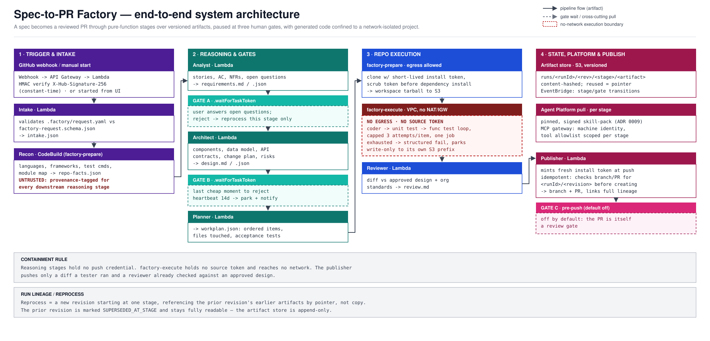

# Spec-to-PR Factory — architecture

**Status:** design · **Depends on:** `01-agent-platform.md` · **Target:** AWS serverless

A customer points the factory at a GitHub repository containing a requirements spec.
The factory analyses the requirements with a human in the loop, produces a design, gets
that design approved, then generates code, unit-tests it, functionally tests it, and
pushes a branch with a pull request. Each agent runs in its own isolated context, one
after another. Any stage can be reprocessed by the user without rerunning the whole run.



---

## 1. The one rule that shapes everything else

**Agents communicate through artifacts, not through conversation.**

Each stage is a pure function:

```
artifact_out = agent(skill_pack@version, model@version, artifacts_in[], repo_facts)
```

A stage never receives the previous stage's chat transcript. It receives a named,
schema-validated artifact, plus the skills and instructions its role declares. Everything
else follows from this:

- **Context isolation** is structural, not a convention. Stage N cannot be polluted by
  stage N-1's reasoning, retries or dead ends.
- **Reprocessing is cheap.** Re-running the design stage means re-invoking one function
  over stored inputs. Nothing downstream is assumed.
- **Runs are reproducible and auditable.** Pin the skill pack, the model and the input
  artifact hashes and you can replay a run and explain any output.
- **Step Functions payloads stay small.** States carry S3 pointers and hashes, never
  content — the 256 KB state payload limit is never in play.

If a future change makes one agent "just pass its context" to the next, that is the
design being abandoned, not an optimisation.

---

## 2. Pipeline

| # | Stage | Compute | Human gate | Output artifact |
|---|---|---|---|---|
| 0 | **Intake** | Lambda | – | `intake.json` — repo access proof, spec parsed and schema-validated |
| 1 | **Recon** | CodeBuild | – | `repo-facts.json` — languages, frameworks, test commands, conventions, module map |
| 2 | **Requirements analyst** | Lambda | **Gate A** | `requirements.md` + `requirements.json` — stories, acceptance criteria, NFRs, open questions |
| 3 | **Architect** | Lambda | **Gate B** | `design.md` + `design.json` — components, data model, API contracts, file-level change plan, test strategy, risks |
| 4 | **Planner** | Lambda | – | `workplan.json` — ordered work items, each with files touched and acceptance tests |
| 5 | **Coder** | CodeBuild | – | `diff.patch` per work item |
| 6 | **Unit tester** | CodeBuild | – | `unit-report.xml`, coverage |
| 7 | **Functional tester** | CodeBuild | – | `functional-report.json`, logs |
| 8 | **Reviewer** | Lambda | – | `review.md` — diff checked against the approved design and org standards |
| 9 | **Publisher** | Lambda | **Gate C** (optional) | branch `factory/<runId>` + PR |

**Gate A** is a clarification loop, not a rubber stamp. The analyst is required to emit
open questions; the user answers them and the stage re-runs with the answers as an input
artifact. Most of the value of the whole system is concentrated here — a spec that
survives Gate A is what makes stages 3-9 worth running.

**Gate B** is the last cheap moment. Rejecting a design costs one stage; rejecting the
code costs six.

**Gate C** defaults to off, because the pull request is itself a review gate. Turn it on
for repositories where a branch push is consequential.

### The coder/tester loop

Stages 5-7 iterate: code → test → fix, capped at **three attempts** per work item. The
loop runs **inside a single CodeBuild job**, not as Step Functions states. This is
deliberate: Standard workflows have a hard 25,000-event execution history limit, and a
per-iteration state machine loop burns it fast. Keeping the loop inside the job also keeps
the failing test output in the same filesystem as the code being fixed.

On exhausting the attempts, the stage fails with a structured reason and the run stops at
a reprocess point rather than pushing broken code.

---

## 3. Orchestration

**AWS Step Functions, Standard workflows.** Express is disqualified outright: its 5-minute
ceiling cannot hold a human approval.

Standard gives what this pipeline needs:

- **1-year maximum execution duration** — a gate can sit for days without special handling.
- **`.waitForTaskToken`** for every human gate. The task token lives as long as the
  execution, so there is no separate token expiry to manage.
- **`HeartbeatSeconds`** on gate states to expire abandoned approvals (default: 14 days →
  `States.Timeout` → notify and park the run).
- **`.sync` integration with CodeBuild** so a build is a single state that blocks until done.

### Reprocess is a new execution, not a redrive

Step Functions has a native `RedriveExecution`, and it is the right tool for exactly one
case: an execution that **failed** on infrastructure (a throttle, a transient build error).
It resumes from the failed step, reuses the execution ARN, and preserves prior results.

It is the wrong tool for user-initiated reprocessing, because it only applies to
FAILED/ABORTED/TIMED_OUT executions, only within **14 days** of completion, and only while
the history stays under 24,999 events. A user asking to redo the design of a successful run
a month later fits none of that.

So reprocessing is modelled explicitly:

```
POST /runs/{runId}/reprocess { "fromStage": "architect", "note": "use the existing
                               event bus instead of a new queue" }

→ creates run revision r2, parentRunId = r1
→ artifacts for stages 0..3 are referenced from r1 (not copied, not recomputed)
→ a new Standard execution starts at `architect` with the note as an extra input artifact
→ r1 is marked SUPERSEDED_AT_STAGE=architect, and stays fully readable
```

Every run is therefore a small DAG of revisions, and the artifact store is append-only.
"What did we approve, and what changed after?" is answerable by diffing two artifacts.

---

## 4. Compute split

Two classes of work with genuinely different shapes.

**Reasoning stages** (intake, analyst, architect, planner, reviewer) → **Lambda**, container
image. They read artifacts and call an LLM. No repository build. Well under the 15-minute
ceiling; 10 GB image size is ample for the runtime plus the skill pack.

**Repository stages** (recon, coder, tester) → **AWS CodeBuild**, invoked `.sync`. CodeBuild
is the pragmatic choice over Fargate here: it exists to clone a repo, install dependencies
and run a test suite, it has a 36-hour ceiling, it is billed per build-minute with nothing
idling between runs, and it produces build logs without extra plumbing. Fargate becomes the
right answer only if a stage needs custom long-lived networking or a service that outlives
the job.

**Two CodeBuild projects, not one**, because the network posture differs:

| Project | Network | Role | Used for |
|---|---|---|---|
| `factory-prepare` | egress allowed (package registries) | can read GitHub token, write artifact prefix | clone, install dependencies, build the image layer cache |
| `factory-execute` | **VPC with no NAT and no IGW** | no source credentials, write-only to its own S3 prefix | run generated code and tests |

Generated code never executes in a container that can reach the network or hold a token
that can push. That separation is the main containment mechanism in the design.

**`factory-prepare`'s own credential hygiene matters just as much as the split.** It holds a
push-capable GitHub token *and* it runs dependency installation, which executes
repo-authored code (postinstall hooks, `setup.py`, build scripts). An egress allowlist to
"legitimate" package registries does not stop token exfiltration — the standard pattern
publishes the secret to the very registry that's allowed. The buildspec therefore fetches
the installation token only for the `git clone` step, through a short-lived credential
helper, and scrubs it — environment, `.git-credentials`, git config — before the install
phase starts. No repo-authored code runs while the token is reachable in the same process
tree. (See ADR 0008.)

---

## 5. Model access

A single `llm` module behind one interface, so the pipeline is not welded to a vendor.

- **Default provider: Amazon Bedrock, Converse API.** Converse is provider-agnostic in
  request shape, normalises tool use and streaming, and lets the stage config swap models
  without touching stage code.
- **Other providers** (Anthropic, OpenAI, Google direct) are supported through the same
  interface with keys in Secrets Manager. Stage config names the provider and model, so a
  run records exactly which model produced which artifact.
- **Model per stage, not per platform.** A cheap fast model for intake and recon; the
  strongest available model for architect and coder; a mid-tier model for review. Model
  choice is configuration, and it belongs in the run record.
- **Throughput.** Use cross-region inference profiles for on-demand capacity, exponential
  backoff with jitter on 429, and consider Provisioned Throughput only once a stage's
  volume is predictable.
- **Cost attribution.** Attach `runId`, `revision` and `stage` as Bedrock request metadata,
  and use application inference profiles so per-run token cost is a query, not an estimate.

---

## 6. How the factory consumes the Agent Platform

The factory is a headless client of the platform described in `01-agent-platform.md`. It
does not author prompts.

**Skills and instructions.** At stage start, the job pulls the **pinned** skill-pack
release from the platform's signed artifact store in S3 and unpacks it to `.agents/` in the
working directory. Each stage declares which skills it loads — the architect does not load
the coder's skills. The pin is recorded in the run record, so an artifact can always be
traced to the exact standards that produced it.

**Instructions** are compiled for a `headless` surface (the platform's adapter layer
already emits per-surface forms), so the same standard that shapes a developer's Copilot
session shapes the factory's coder.

**MCP.** Every stage reaches tools through the platform's MCP gateway using a **machine
identity** with its own entitlement group — never a developer's token. The tool allowlist
is per stage:

| Stage | Tools |
|---|---|
| Analyst | `ask_internal`, `search_docs` (internal knowledge only) |
| Architect | `ask_internal`, `get_doc`, architecture decision lookup |
| Coder | repo tools, dependency lookup — **no** knowledge-base write, **no** deploy |
| Tester | test runner tools only |
| Publisher | GitHub app tools, scoped to one repo and one branch prefix |

This is what keeps the tool count per stage small, which is the practical defence against
context bloat and mis-selection.

---

## 7. Request format

The customer repository supplies `.factory/request.yaml` plus a markdown spec. Schema is
`schemas/factory-request.schema.json`; intake validates and fails fast with line-level
errors rather than guessing.

```yaml
apiVersion: factory/v1
kind: ChangeRequest
metadata:
  title: Add refund reconciliation report
  requestedBy: ymadhu@example.com
spec:
  goal: >
    Finance needs a weekly report reconciling refunds against the ledger.
  inScope:
    - New report endpoint and query
    - Scheduled weekly generation
  outOfScope:
    - Changes to the refund flow itself
  acceptanceCriteria:
    - id: AC1
      given: a week with mismatched refunds
      when: the report runs
      then: each mismatch appears with refund id, ledger id and delta
  constraints:
    - Must not add a new datastore
    - Must use the existing job scheduler
  targetBranch: main
  branchPrefix: factory/
  testCommands:
    unit: npm test
    functional: npm run test:e2e
  definitionOfDone:
    - unit tests pass
    - functional tests pass
    - no new lint errors
  budget:
    maxUsd: 25
    maxDurationHours: 48
```

`budget` is not decoration. A run that exceeds it aborts at the next stage boundary and
parks for human decision.

---

## 8. State and artifacts

**DynamoDB, single table.**

```
PK                 SK                          notes
RUN#<runId>        META                        status, revision, parentRunId, repo, budget, pins
RUN#<runId>        STAGE#<nn>#<stage>          status, artifact keys, hashes, model, tokens, cost
RUN#<runId>        GATE#<gateId>               taskToken, requestedAt, decidedBy, decision, note
GSI1: STATUS#<s>   UPDATED#<ts>                dashboard queries, stuck-run sweeps
```

**S3, versioned, immutable.**

```
s3://factory-artifacts/runs/<runId>/<revision>/<stage>/<artifact>
```

Artifacts are content-hashed. A revision that reuses an earlier stage stores a pointer,
not a copy.

**EventBridge** carries stage transitions (`StageStarted`, `StageCompleted`, `GateOpened`,
`RunParked`). Notifications, dashboard pushes and telemetry all subscribe there rather
than being called directly by the orchestrator.

---

## 9. Human-in-the-loop surface

Simplest stack that is credible for this:

- **API Gateway (HTTP API) + Lambda + Cognito** for authenticated actions: approve, reject
  with feedback, reprocess from stage, cancel, adjust budget.
- **AppSync Events** for live run updates, chosen over a WebSocket API because API Gateway
  WebSocket connections are capped at 2 hours and gates outlive that by design.
- **React SPA on S3 + CloudFront**. Views: run list, run timeline with per-stage artifacts,
  side-by-side diff of an artifact against its previous revision, and the gate screen.
- **Notifications** via SES and a Slack webhook, carrying a deep link, never the approval
  itself — approval happens in the authenticated UI so the decision has an identity on it.

The gate screen shows the artifact, the open questions, the cost so far, and three actions:
approve, reject with note (→ reprocess this stage), or park.

---

## 10. GitHub integration

- **GitHub App**, not a PAT. Installation tokens are short-lived and scoped per repository;
  a PAT on a code-writing system is an unnecessary standing risk. Because gates can hold a
  run open for days (§9), no stage caches a token past its own execution — the publisher
  mints a fresh installation token at push time, never reuses one fetched at intake.
- **Webhook** → API Gateway → Lambda, verifying `X-Hub-Signature-256` with a constant-time
  comparison before any processing. A run can also be started from the UI.
- **Push and PR** happen only in the publisher stage, from a fixed template. The branch name
  is derived from the run id; the LLM never chooses the push target. The PR body links the
  requirements artifact, the approved design, the test reports and the run record.
- **Publisher is idempotent.** Before creating anything, it looks up an existing branch or
  PR named from `<runId>/<revision>`. A retried publish (Step Functions retry, a redrive
  after a throttle) updates that branch and PR rather than opening a duplicate.

---

## 11. Security

**The repository is untrusted input.** Its README, issues, comments and code can contain
instructions aimed at the model. The containment rule: *the stages that read untrusted
content hold no credentials that can act, and the stage that acts reads no untrusted
content it has not already been approved against.* Concretely — the analyst and architect
read the repo but cannot push; the publisher pushes but only a diff that a tester produced
and a reviewer checked against an approved design.

- `repo-facts.json` and any repo file content quoted into a prompt are **untrusted data**,
  the same as knowledge-service results in `01-agent-platform.md` §6: delimited, tagged with
  provenance, and never treated as instructions. Recon's own output is repo-derived — a
  malicious README or config can plant a "convention" aimed at the architect or coder, not
  just the analyst reading the spec.
- Generated code runs in `factory-execute` with no network egress and a role limited to one
  S3 prefix.
- Secrets in Secrets Manager (GitHub App private key, provider API keys) with rotation;
  Parameter Store for non-secret config.
- One IAM role per stage, least privilege, no shared execution role.
- Bedrock model invocation logging on, for audit of what was sent and returned.
- Artifact bucket: versioned, encrypted, no public access, lifecycle to Glacier after 90 days.

---

## 12. Observability

Per-run, emitted to CloudWatch and queryable:

- Cost and token count per stage, attributed with `runId`/`stage` request metadata.
- Wall-clock split between compute time and gate waiting time — expect the second to
  dominate, and expect it to be the thing worth optimising.
- Coder retry count and first-attempt test pass rate. This is the single best quality signal
  the system produces; if it falls, the skill pack or model choice regressed.
- Reprocess rate per stage. Heavy reprocessing at Gate A means the request schema needs work;
  at Gate B means the architect's skill pack does.
- Runs reaching PR, and PRs merged without modification.

---

## 13. Delivery phases

**Phase 1 — the loop, end to end, with nothing clever.** Intake, recon, analyst, Gate A,
and a publisher that opens a PR containing only the requirements document. This proves
webhook → orchestration → gate → PR, which is the risky integration surface, and it is
useful on its own as a requirements-clarifier.
*Accept when:* a spec in a real repo produces a requirements PR, and a Gate A rejection
with a note produces a revised document without rerunning intake.

**Phase 2 — design and reprocess.** Architect, Gate B, the revision model, and the run UI.
*Accept when:* a user can reprocess from any completed stage, and the artifact lineage of a
three-revision run is legible.

**Phase 3 — code and unit tests.** Coder and unit tester in CodeBuild with the two-project
network split, the bounded retry loop, and branch push.
*Accept when:* generated code runs only in the no-egress project, and an exhausted retry
loop parks the run instead of pushing.

**Phase 4 — functional tests and review.** Functional tester, reviewer against the approved
design, PR body with full traceability.

**Phase 5 — economics.** Budget enforcement, cost dashboards, model tiering per stage,
telemetry on retry and reprocess rates.

---

## 14. Non-goals for v1

- No automatic merge. The factory opens a PR; humans merge.
- No multi-repository changes in one run.
- No infrastructure provisioning by the agent.
- No code written before a design is approved.
- No agent-to-agent conversation. See section 1.

---

## 15. Open questions

1. **Single-tenant or multi-tenant?** Multi-tenant changes the identity model, the S3
   layout and the budget enforcement from simple to significant. Answer before Phase 1.
2. **Where does the factory's own machine identity live** in the entitlement model, and who
   approves what it may reach?
3. **Does an existing internal CI system** already have repo-clone-and-test capability worth
   reusing instead of CodeBuild?
4. **What is the acceptable cost ceiling per run**, and is it enforced hard or advisory?
5. **Which model provider is the default**, and is there an org constraint requiring
   inference to stay in-region?
